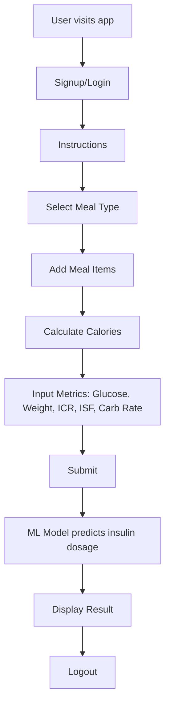

# Type-1 Diabetes Insulin Predictor

A Flask-based web application designed to help Type-1 Diabetes patients predict optimal insulin dosage based on meal composition, carbohydrate intake, glucose levels, and personal metabolic factors.

## Project Overview

The **Type-1 Diabetes Insulin Predictor** is a machine learning-powered web application specifically designed for Type-1 Diabetes patients to make informed decisions about their insulin dosage. The application takes into account multiple factors including:

- **Meal composition and carbohydrate content**
- **Current glucose levels**
- **Body weight**
- **Individual Insulin-to-Carb Ratio (ICR)**
- **Insulin Sensitivity Factor (ISF)**

By leveraging a trained Machine Learning model, the application provides personalized insulin dosage predictions to help patients manage their diabetes more effectively and maintain optimal blood glucose levels.

## Features

- **User Authentication**: Secure signup and login system with session management
- **Interactive Instructions**: Comprehensive guide for new users
- **Meal Type Selection**: Choose from Breakfast, Lunch, Snack, or Dinner
- **Dynamic Meal Builder**: Add multiple meal items with customizable quantities
- **Automatic Calorie Calculation**: Real-time calculation of total calories for selected meals
- **ML-Powered Predictions**: Advanced machine learning model for accurate insulin dosage prediction
- **Session Management**: Maintains user state throughout the application flow
- **Responsive Design**: Modern UI built with HTML, CSS, Bootstrap, and JavaScript
- **Data Persistence**: JSON-based storage for user information and meal data

## Project Flow



## Technology Stack

- **Backend**: Python, Flask
- **Frontend**: HTML5, CSS3, Bootstrap 5, JavaScript
- **Machine Learning**: Joblib, Pandas
- **Data Storage**: JSON files
- **Session Management**: Flask sessions
- **Model Deployment**: Pickle serialization

## Folder Structure

```
Type-1-Diabetes-Insulin-Predictor/
├─ app.py
├─ insulin_predictor_final.pkl
├─ requirements.txt
├─ README.md
├─ Logs/
│   └─ users.json
├─ templates/
│   ├─ base.html
│   ├─ welcome.html
│   ├─ signup.html
│   ├─ login.html
│   ├─ instructions.html
│   ├─ meals.html
│   ├─ calories.html
│   └─ predict.html
└─ static/
    ├─ css/
    ├─ js/
    └─ images/
```

## Installation

Follow these steps to set up the project locally:

### Prerequisites
- Python 3.7 or higher
- pip package manager

### Setup Instructions

```bash
# Clone the repository
git clone <repository-url>
cd Type-1-Diabetes-Insulin-Predictor

# Create a virtual environment
python -m venv venv

# Activate virtual environment
# On Linux/Mac:
source venv/bin/activate
# On Windows:
venv\Scripts\activate

# Install required dependencies
pip install -r requirements.txt

# Run the Flask application
python app.py

# Open your browser and navigate to:
# http://127.0.0.1:5000
```

## Usage Flow

### Step-by-Step User Journey

1. **Authentication**
   - New users sign up with their credentials
   - Existing users log in to access the application

2. **Instructions**
   - Read comprehensive guidelines on how to use the application
   - Understand the importance of accurate input data

3. **Meal Selection**
   - Choose meal type: Breakfast, Lunch, Snack, or Dinner
   - Browse available meal options

4. **Meal Composition**
   - Add multiple meal items to your selection
   - Specify quantities for each item
   - View automatic calorie calculations

5. **Health Metrics Input**
   - Enter current glucose level (mg/dL)
   - Input body weight (kg)
   - Provide Insulin-to-Carb Ratio (ICR)
   - Enter Insulin Sensitivity Factor (ISF)
   - Specify carbohydrate rate

6. **Prediction**
   - Submit all information for processing
   - Machine learning model analyzes the data
   - Receive personalized insulin dosage recommendation

7. **Results & Logout**
   - View detailed prediction results
   - Safely logout to end the session

## Model Information

The application uses a pre-trained machine learning model (`insulin_predictor_final.pkl`) that has been trained on diabetes management data to provide accurate insulin dosage predictions based on the input parameters.

## Important Disclaimer

⚠️ **Medical Disclaimer**: This application is for educational and informational purposes only. Always consult with your healthcare provider before making any changes to your insulin regimen. This tool should not replace professional medical advice, diagnosis, or treatment.

## Contributing

Contributions are welcome! Please feel free to submit a Pull Request. For major changes, please open an issue first to discuss what you would like to change.

## Contributors

- **[Your Name]** - *Initial work and development*

## License

This project is licensed under the MIT License - see the [LICENSE](LICENSE) file for details.

---

**Built with ❤️ for the Type-1 Diabetes community**